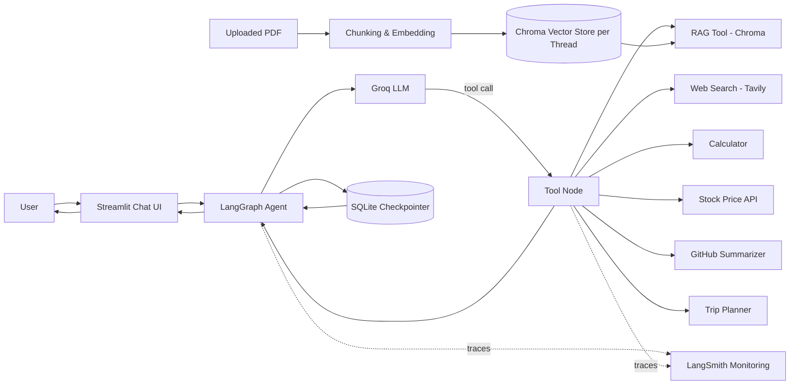
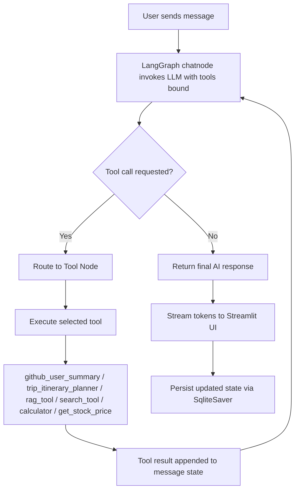

> **A multi-tool, memory-persistent RAG chatbot built with LangGraph, Groq, and Streamlit.**
>
> LangGraph-RAG-Chatbot is a **Generative AI / Agentic RAG** application that combines a LangGraph tool-calling agent with per-thread PDF retrieval, live web search, and utility tools (GitHub profile summarizer, trip planner, calculator, stock prices) — all wrapped in a persistent, multi-threaded Streamlit chat interface and fully **monitored with LangSmith** for tracing, debugging, and observability.

<p align="center">


</p>

---

## 🌟 Key Highlights

- 🧑‍💻 GitHub profile → recruiter-style skills summary generator
- 🗺️ AI-powered trip itinerary planner with real geolocation & weather
- 🤖 LangGraph agent with automatic tool-calling and conditional routing
- 📄 Per-thread PDF ingestion & Retrieval-Augmented Generation (RAG)
- 🧵 Persistent, multi-threaded conversations via SQLite checkpointing
- 🔍 Live web search tool (Tavily) for real-time facts and news
- 🌊 Streaming responses with live "tool in use" status indicators
- 🏷️ Auto-generated, cached chat titles (ChatGPT-style)
- 📈 End-to-end run monitoring, tracing, and debugging via **LangSmith**

> **Portfolio Project:** This repository demonstrates practical agentic AI engineering — tool orchestration, stateful graph execution, retrieval-augmented generation, and a production-style conversational UI.

## 🚀 Live Demo

🔗 **Live Project:** [Click here](https://langgraph-chatbot-yash272002.streamlit.app/)

## 📑 Table of Contents

- [System Architecture](#️-system-architecture)
- [Agent Workflow](#-agent-workflow)
- [Features](#-features)
- [Available Tools](#-available-tools)
- [AI/ML Concepts Demonstrated](#-aiml-concepts-demonstrated)
- [Tech Stack](#️-tech-stack)
- [Installation](#️-installation)
- [Environment Variables](#-environment-variables)
- [Usage](#-usage)
- [License](#-license)

---

## 🏗️ System Architecture



### Architecture Overview

The application is built around a **LangGraph state graph** that wraps a Groq-hosted LLM (`openai/gpt-oss-20b`) with tool-calling capability. Each user message enters the graph at the chat node; if the model decides a tool is needed, execution is routed to the tool node and looped back until a final answer is produced. Conversation state (including full message history) is persisted per **thread** using a SQLite-backed checkpointer, enabling multiple independent, resumable chat sessions.

For document-grounded questions, PDFs uploaded through the sidebar are chunked, embedded with a local HuggingFace embedding model, and stored in a **per-thread Chroma vector store**, so retrieval context never leaks across conversations.

Every graph run — LLM calls, tool invocations, and inputs/outputs — is automatically traced to **LangSmith**, giving full visibility into agent decisions, latency, and token usage for debugging and continuous improvement.

## 🔄 Agent Workflow



### Workflow Explanation

1. The user's message is added to the thread's message state and passed to the `chatnode`.
2. The LLM (bound to all available tools) decides whether to answer directly or invoke a tool.
3. `tools_condition` routes execution to the `ToolNode` when a tool call is present.
4. The relevant tool executes (GitHub analysis, trip planning, RAG lookup, web search, calculation, or stock quote) and returns structured results.
5. Tool output is fed back into the graph, and the LLM produces a final response.
6. The response is streamed token-by-token to the Streamlit UI, with a live status badge showing which tool is running.
7. The full state is checkpointed to SQLite so the thread can be resumed later.

## ✨ Features

### 🧵 Multi-Thread Conversation Memory

- Each chat session gets a unique UUID thread ID
- Full message history persisted via `SqliteSaver` checkpointing
- Sidebar lists all past conversations with auto-generated titles
- Instantly switch between threads without losing context

---

### 📄 Per-Thread PDF Retrieval (RAG)

- Upload a PDF directly from the sidebar for the active chat
- Text is extracted page-by-page, chunked (`RecursiveCharacterTextSplitter`), and embedded with `BAAI/bge-small-en-v1.5`
- Stored in an isolated Chroma collection per thread — no cross-thread leakage
- Self-healing retriever: automatically re-hydrates from disk if the app restarts
- Sidebar shows live indexing status and document stats (pages / chunks)

---

### 🌐 Streaming Chat with Tool Visibility

- Token-level streaming of assistant responses
- Real-time "🔧 Using `tool_name`…" status while a tool executes
- Clean separation between AI messages and tool messages in the stream

---

### 🧠 Agentic Tool Use

- The LLM autonomously decides when to search the web, query the PDF, do math, fetch a stock price, analyze a GitHub profile, or plan a trip
- Tools return structured data that the LLM synthesizes into natural-language answers

## 🛠 Available Tools

| Tool | Description |
|------|-------------|
| `github_user_summary` | Pulls a GitHub user's public profile & repos and generates a recruiter-style skills summary (LLM-written) |
| `trip_itinerary_planner` | Geocodes origin/destination, computes distance, fetches destination weather (Open-Meteo), and generates a full day-by-day itinerary (LLM-written) |
| `rag_tool` | Retrieves relevant chunks from the active thread's indexed PDF via Chroma similarity search |
| `search_tool` | Live web search via the Tavily API for current events and real-time facts |
| `calculator` | Basic arithmetic (add, sub, mul, div) with safe error handling |
| `get_stock_price` | Fetches the latest quote for a ticker symbol via the Alpha Vantage API |

## 🧠 AI/ML Concepts Demonstrated

| Concept | Implementation |
|---------|----------------|
| **Agentic Orchestration** | LangGraph state graph with conditional tool routing (`tools_condition`) |
| **Retrieval-Augmented Generation** | Per-thread Chroma vector store queried by a dedicated `rag_tool` |
| **Tool Calling / Function Calling** | LLM bound to six tools via `bind_tools`, selecting them autonomously |
| **Stateful Persistence** | `SqliteSaver` checkpointer for durable, resumable multi-thread memory |
| **Embeddings** | Local HuggingFace sentence-embedding model (`BAAI/bge-small-en-v1.5`) |
| **Streaming Inference** | Token-level streaming from graph to UI via `stream_mode="messages"` |
| **API Orchestration** | Combines LLM output with external APIs (GitHub, Open-Meteo, Nominatim, Tavily, Alpha Vantage) |
| **Observability / Monitoring** | Full run tracing (LLM calls, tool calls, latency, tokens) via **LangSmith** |

## 🛠️ Tech Stack

| Category | Technologies |
|----------|--------------|
| **Programming Language** | Python 3.11+ |
| **Agent Framework** | LangGraph |
| **LLM Orchestration** | LangChain |
| **LLM Provider** | Groq (`openai/gpt-oss-20b` via `langchain_groq`) |
| **Embeddings** | HuggingFace (`BAAI/bge-small-en-v1.5`) |
| **Vector Store** | Chroma |
| **PDF Parsing** | pypdf |
| **Web Search** | Tavily API |
| **Persistence** | SQLite (`langgraph.checkpoint.sqlite.SqliteSaver`) |
| **Monitoring / Observability** | LangSmith |
| **Web App** | Streamlit |


# ⚙️ Installation

## Prerequisites

Before getting started, ensure you have the following installed:

- Python **3.11+**
- **pip** or **uv** package manager
- API keys for Groq, Tavily, Alpha Vantage, and LangSmith (see below)

---

## 1. Clone the Repository

```bash
git clone <repository-url>
cd langgraph-rag-chatbot
```

---

## 2. Install Dependencies

```bash
pip install -r requirements.txt
```

---

## 3. Configure Environment Variables

Create a `.env` file in the project root (see [Environment Variables](#-environment-variables) below).

---

## 4. Running the Streamlit App

```bash
streamlit run streamlit_frontend_raag.py
```

## 🔑 Environment Variables

| Variable | Required | Purpose |
|----------|----------|---------|
| `GROQ_API_KEY` | ✅ | Authenticates requests to the Groq-hosted LLM |
| `TAVILY_API_KEY` | ✅ | Enables the live `search_tool` web search |
| `LANGSMITH_TRACING` | ✅ | Set to `true` to enable LangSmith tracing for all graph runs |
| `LANGSMITH_API_KEY` | ✅ | Authenticates with LangSmith for run monitoring and tracing |
| `LANGSMITH_PROJECT` | ⬜ | Optional project name to group traces in the LangSmith dashboard (defaults to `default`) |

> Note: `get_stock_price` currently uses an inline Alpha Vantage key for demo purposes — replace it with your own key via an environment variable before deploying.

With `  LANGSMITH_TRACING= 'true` set, every chatbot invocation — LLM calls, tool calls, inputs, outputs, latency, and token usage — is automatically streamed to your [LangSmith](https://smith.langchain.com/) dashboard for real-time monitoring and debugging, no additional code changes required.

# Local Setup

Once the Streamlit app is running:

1. Open the app in your browser (default: `http://localhost:8501`).
2. Start typing in the chat box to talk to the agent directly, or...
3. Upload a PDF from the sidebar to enable document-grounded Q&A for that chat thread.
4. Ask questions naturally — the agent automatically decides whether to answer directly or call a tool (search the web, query your PDF, do math, fetch a stock price, summarize a GitHub profile, or plan a trip).
5. Use **New Chat** to start a fresh, independently persisted thread, and revisit any past conversation from the sidebar at any time.


## 📄 License

This project is licensed under the MIT License. See the `LICENSE` file for details.